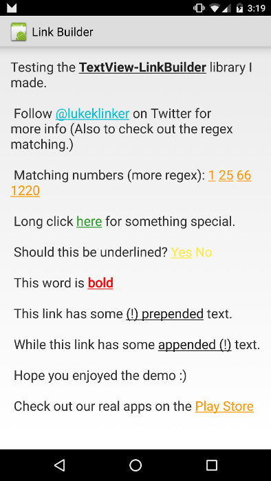

# Android TextView-LinkBuilder [](https://android-arsenal.com/details/1/2049)



Insanely easy way to create clickable links within a TextView. 

While creating [Talon for Twitter](https://github.com/klinker24/Talon-for-Twitter), one of the most difficult things I encountered was creating these clickable links based on specific text. Luckily, I have made it easy for anyone to apply this type of style to their TextView's.

## Features

Similar to how all the big players do it (Google+, Twitter, *cough* Talon *cough*), this library allows you to create clickable links for any combination of Strings within a TextView.

 - Specify long and short click actions of a specific word within your TextView
 - Provide user feedback by highlighting the text when the user touches it
 - Match single strings or use a regular expression to set clickable links to any text conforming to that pattern
 - Change the color of the linked text
 - Modify the transparency of the text's highlighting when the user touches it
 - Set whether or not you want the text underlined

The main advantage to using this library over TextView's autolink functionality is that you can link anything, not just web address, emails, and phone numbers. It also provides color customization and touch feedback.

## Installation

There are two ways to use this library:

#### As a Gradle dependency

This is the preferred way. Simply add:

```groovy
// make sure you have added the snapshot repository
repositories {
    maven {
        url 'https://oss.sonatype.org/content/repositories/snapshots/'
    }
}

dependencies {
    compile 'com.klinkerapps:link_builder:1.0.3-SNAPSHOT@aar'
}
```

to your project dependencies and run `gradle build` or `gradle assemble`.

#### As a library project

Download the source code and import it as a library project in Eclipse. The project is available in the folder **library**. For more information on how to do this, read [here](http://developer.android.com/tools/projects/index.html#LibraryProjects).

## Example Usage

Functionality can be found in the example's [MainActivity](https://github.com/klinker24/Android-TextView-LinkBuilder/blob/master/example/src/main/java/com/klinker/android/link_builder_example/MainActivity.java)

```java
// Create the link rule to set what text should be linked.
// can use a specific string or a regex pattern
Link link = new Link("click here")
    .setTextColor(Color.parseColor("#259B24"))    // optional, defaults to holo blue
    .setHighlightAlpha(.4f) 					  // optional, defaults to .15f
    .setUnderlined(false) 						  // optional, defaults to true
    .setOnLongClickListener(new Link.OnLongClickListener() {
        @Override
        public void onLongClick(String clickedText) {
        	// long clicked
        }
    })
    .setOnClickListener(new Link.OnClickListener() {
        @Override
        public void onClick(String clickedText) {
        	// single clicked
        }
    });

// create the link builder object add the link rule
new LinkBuilder(textView)
    .addLink(link)
    .build(); // create the clickable links
```

## Contributing

Please fork this repository and contribute back using [pull requests](https://github.com/klinker24/Android-TextView-LinkBuilder/pulls). Features can be requested using [issues](https://github.com/klinker24/Android-TextView-LinkBuilder/issues). All code, comments, and critiques are greatly appreciated.


## License

    Copyright 2015 Luke Klinker

    Licensed under the Apache License, Version 2.0 (the "License");
    you may not use this file except in compliance with the License.
    You may obtain a copy of the License at

       http://www.apache.org/licenses/LICENSE-2.0

    Unless required by applicable law or agreed to in writing, software
    distributed under the License is distributed on an "AS IS" BASIS,
    WITHOUT WARRANTIES OR CONDITIONS OF ANY KIND, either express or implied.
    See the License for the specific language governing permissions and
    limitations under the License.
